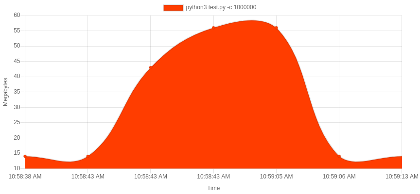
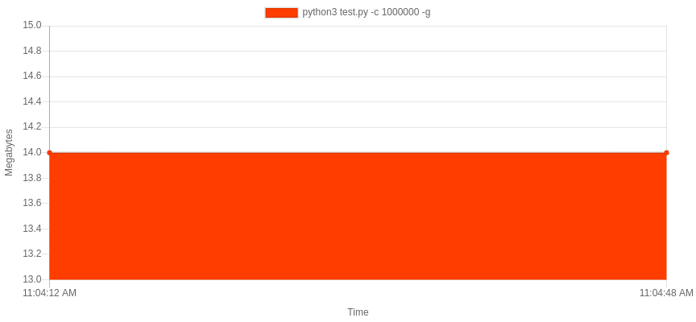

## Generation vs Accumulation

What's the difference in performance? A simple experiment is to see how memory usage is affected when using a generator pattern vs an accumulator pattern. We modify strings and return them. While the runtime is similar, the memory usage is not at all.

In the accumulator pattern, we see that the memory usage spikes as the program creates an object to return that's quite sizeable:

In the generator pattern, memory usage remains flat as the strings are produced on-demand.

Images generated using the fabulous tool ['mem_usage_ui'](https://github.com/parikls/mem_usage_ui), by @parikls.